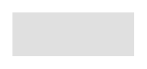

# Raised Button (Pressed)

## Definition

```
{
  _style: 'whiteSpace=wrap;html=1;dashed=0;align=center;fontSize=12;shape=rect;fillColor=#000000;strokeColor=none;fontStyle=1;opacity=12;fontColor=#BDBDBD;',
  _width: 100,
  _height: 36,
}
```

## Usage

```
import { RaisedButtonPressed } from '@reactiac/standard-components-diagrams/gmdlButtons'

<RaisedButtonPressed/>
```

## Preview


