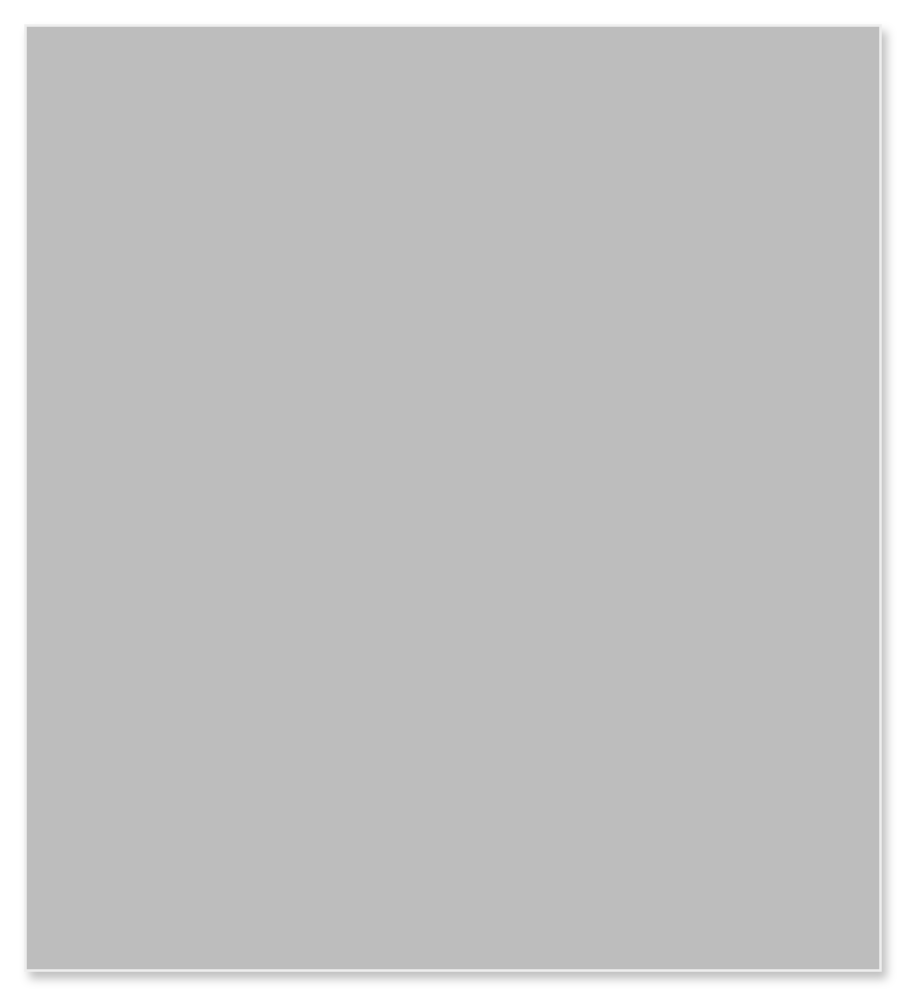

# Card 3

## Definition

```
{
  _style: { 
    entity: 'shape=rect;fillColor=#BDBDBD;strokeColor=#eeeeee;shadow=1;html=1;',
  },
  _original_width: 342,
  _original_height: 378,
}
```

## Usage

```
import { Card3 } from '@dinghy/standard-components-diagrams/gmdlCards'

<Card3/>
```

## Preview


