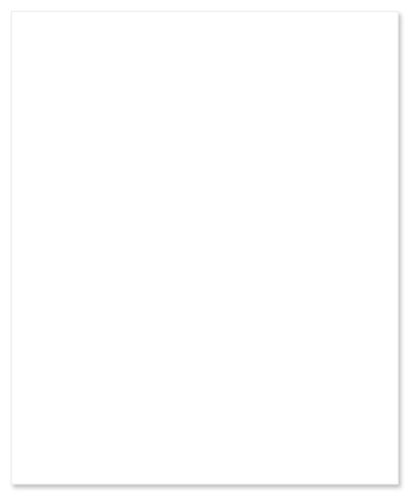

# Card 4

## Definition

```
{
  _style: { 
    entity: 'shape=rect;fillColor=#ffffff;strokeColor=#eeeeee;shadow=1;',
  },
  _original_width: 344,
  _original_height: 420,
}
```

## Usage

```
import { Card4 } from '@dinghy/standard-components-diagrams/gmdlCards'

<Card4/>
```

## Preview


