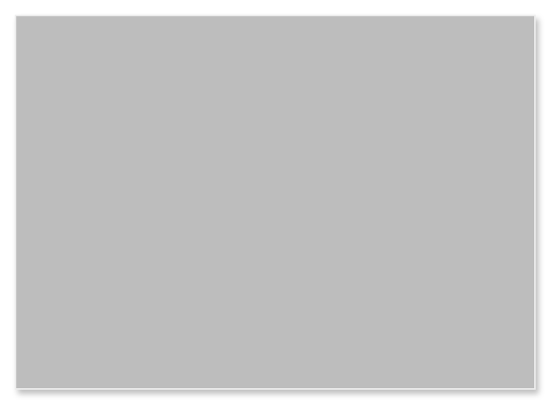

# Card 6

## Definition

```
{
  _style: 'shape=rect;fillColor=#BDBDBD;strokeColor=#eeeeee;shadow=1;html=1;whiteSpace=wrap;',
  _width: 342,
  _height: 246,
}
```

## Usage

```
import { Card6 } from '@reactiac/standard-components-diagrams/gmdlCards'

<Card6/>
```

## Preview


