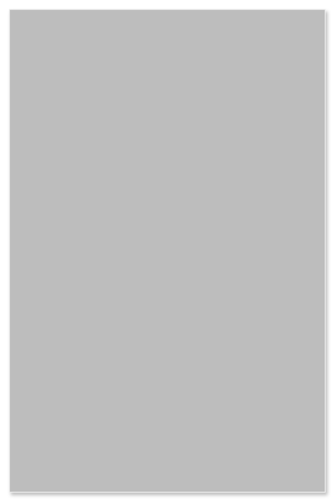

# Card with segmented buttons

## Definition

```
{
  _style: { 
    entity: 'shape=rect;fillColor=#BDBDBD;strokeColor=#eeeeee;shadow=1;',
  },
  _width: 342,
  _height: 522,
}
```

## Usage

```
import { CardWithSegmentedButtons } from '@diac/standard-components-diagrams/gmdlCards'

<CardWithSegmentedButtons/>
```

## Preview


