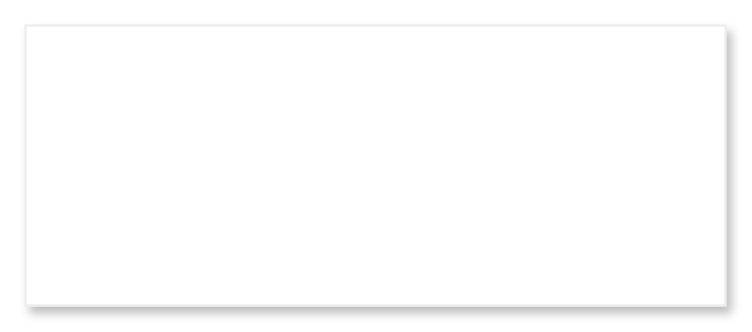

# Dialog with scrollable list 2

## Definition

```
{
  _style: { 
    entity: 'shape=rect;fontSize=18;fillColor=#ffffff;strokeColor=#eeeeee;shadow=1;fontSize=17;fontColor=#666666;align=left;spacing=16;align=left;verticalAlign=top;whiteSpace=wrap;html=1;',
  },
  _width: 280,
  _height: 112,
}
```

## Usage

```
import { DialogWithScrollableList2 } from '@diac/standard-components-diagrams/gmdlDialogs'

<DialogWithScrollableList2/>
```

## Preview


