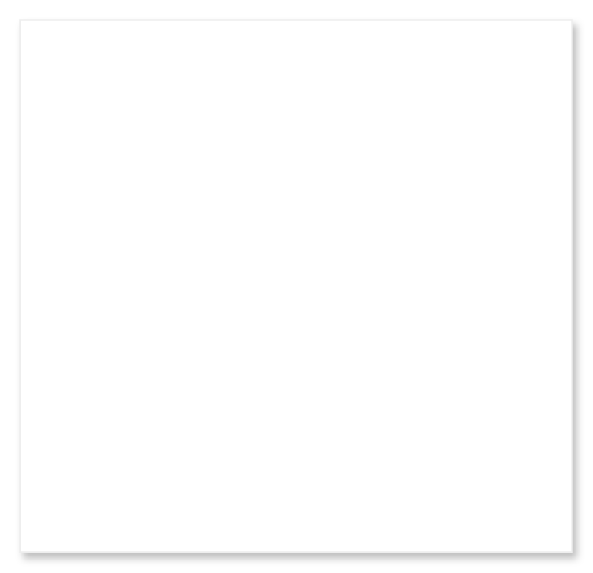

# Dialog with scrollable list

## Definition

```
{
  _style: 'shape=rect;fontSize=18;fillColor=#ffffff;strokeColor=#eeeeee;shadow=1;',
  _width: 280,
  _height: 270,
}
```

## Usage

```
import { DialogWithScrollableList } from '@reactiac/standard-components-diagrams/gmdlDialogs'

<DialogWithScrollableList/>
```

## Preview


