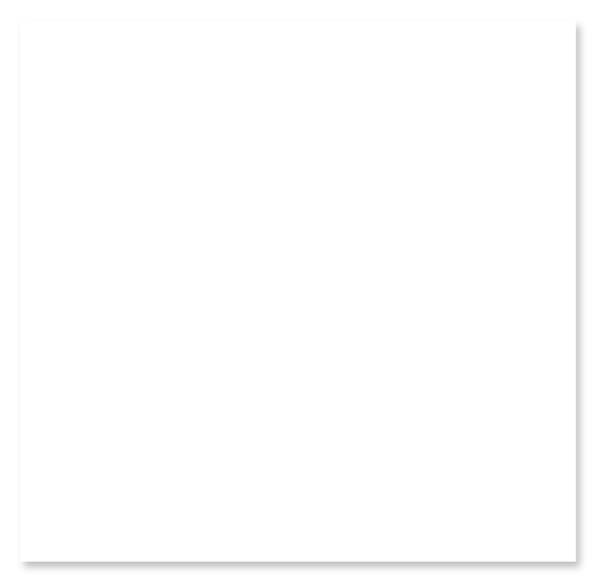

# Dialog

## Definition

```
{
  _style: { 
    entity: 'dashed=0;shape=rect;fillColor=#ffffff;strokeColor=none;shadow=1;fontSize=19;fontColor=#000000;spacingTop=-6;whiteSpace=wrap;spacing=16;align=left;verticalAlign=top;html=1;',
  },
  _width: 280,
  _height: 273,
}
```

## Usage

```
import { Dialog } from '@diac/standard-components-diagrams/gmdlDialogs'

<Dialog/>
```

## Preview


