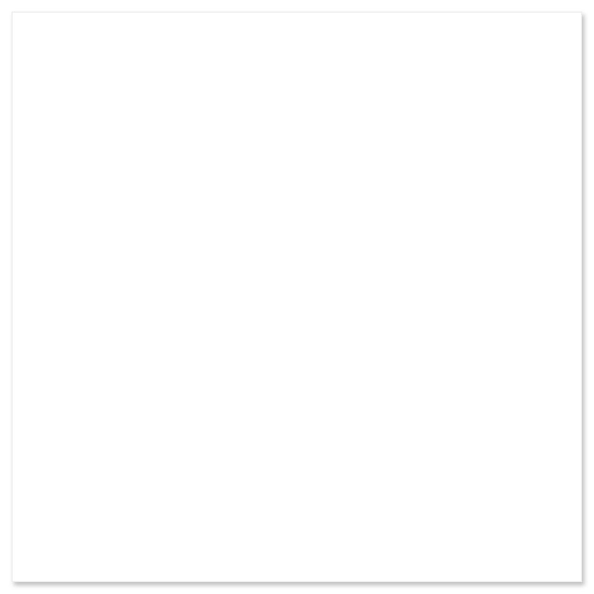

# Message dialog

## Definition

```
{
  _style: 'dashed=0;shape=rect;fillColor=#ffffff;strokeColor=#eeeeee;shadow=1;whiteSpace=wrap;html=1;',
  _width: 480,
  _height: 480,
}
```

## Usage

```
import { MessageDialog } from '@reactiac/standard-components-diagrams/gmdlDialogs'

<MessageDialog/>
```

## Preview


