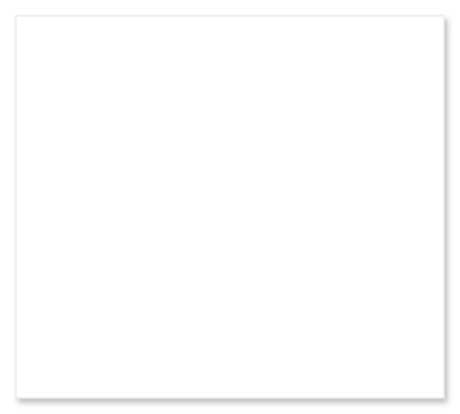

# Simple dialog

## Definition

```
{
  _style: { 
    entity: 'shape=rect;fillColor=#ffffff;strokeColor=#eeeeee;shadow=1;fontSize=20;fontColor=#000000;align=left;spacing=16;verticalAlign=top;fontStyle=0;spacingTop=-5;recursiveResize=0;whiteSpace=wrap;html=1;',
  },
  _original_width: 280,
  _original_height: 250,
}
```

## Usage

```
import { SimpleDialog } from '@diac/standard-components-diagrams/gmdlDialogs'

<SimpleDialog/>
```

## Preview


