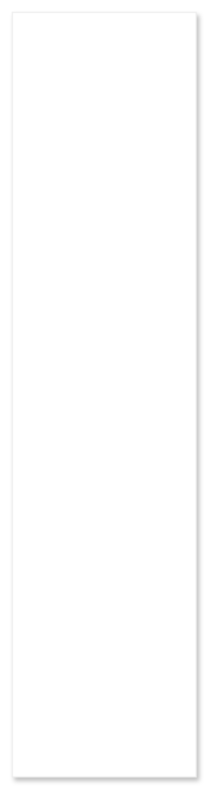

# Item list

## Definition

```
{
  _style: { 
    entity: 'shape=rect;strokeColor=#eeeeee;fillColor=#ffffff;shadow=1;',
  },
  _original_width: 152,
  _original_height: 631,
}
```

## Usage

```
import { ItemList } from '@dinghy/standard-components-diagrams/gmdlLists'

<ItemList/>
```

## Preview


