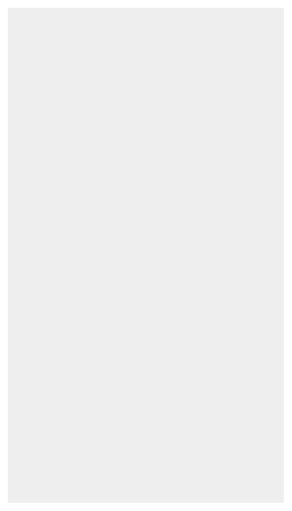

# Background (Light)

## Definition

```
{
  _style: { 
    entity: 'shape=rect;fillColor=#eeeeee;strokeColor=none;',
  },
  _original_width: 358,
  _original_height: 642,
}
```

## Usage

```
import { BackgroundLight } from '@dinghy/standard-components-diagrams/gmdlMisc'

<BackgroundLight/>
```

## Preview


