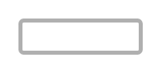

# Checkbox (off, disabled, light))

## Definition

```
{
  _style: { 
    entity: 'dashed=0;labelPosition=right;align=left;shape=mxgraph.gmdl.checkbox;strokeColor=#B0B0B0;fillColor=none;strokeWidth=2;aspect=fixed;sketch=0;html=1;',
  },
  _original_width: 0,
  _original_height: 16,
}
```

## Usage

```
import { CheckboxOffDisabledLight } from '@dinghy/standard-components-diagrams/gmdlSelectionControls'

<CheckboxOffDisabledLight/>
```

## Preview


