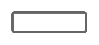
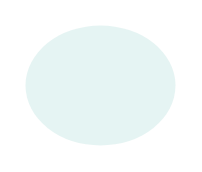

# Gmdl Selection Controls Entities

- [CheckboxOffDisabledLight](./checkbox-off-disabled-light.md)  

- [CheckboxOffFocusedOrPressedLight](./checkbox-off-focused-or-pressed-light.md)  

- [CheckboxOffHoverDark](./checkbox-off-hover-dark.md)  

- [CheckboxOffHoverLight](./checkbox-off-hover-light.md)  

- [CheckboxOnDisabledDark](./checkbox-on-disabled-dark.md)  

- [CheckboxOnDisabledFocusedLight](./checkbox-on-disabled-focused-light.md)  

- [CheckboxOnDisabledLight](./checkbox-on-disabled-light.md)  

- [CheckboxOnFocusedOrPressed](./checkbox-on-focused-or-pressed.md)  

- [CheckboxOnHover](./checkbox-on-hover.md)  

- [RadioButtonOffDisabledLight](./radio-button-off-disabled-light.md)  

- [RadioButtonOffHoverDark](./radio-button-off-hover-dark.md)  

- [RadioButtonOffHoverLight](./radio-button-off-hover-light.md)  

- [RadioButtonOnDisabledDark](./radio-button-on-disabled-dark.md)  

- [RadioButtonOnDisabledLight](./radio-button-on-disabled-light.md)  

- [RadioButtonOnHover](./radio-button-on-hover.md)  

- [SwitchOff](./switch-off.md)  

- [SwitchOnDark](./switch-on-dark.md)  

- [SwitchOnLight](./switch-on-light.md)  

