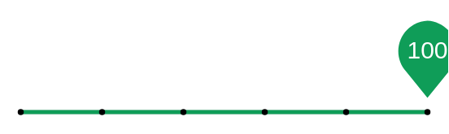

# Discrete slider (click, light) 2

## Definition

```
{
  _style: { 
    entity: 'dashed=0;verticalLabelPosition=bottom;verticalAlign=top;align=center;shape=mxgraph.gmdl.sliderDiscreteDots;barPos=100;bright=1;strokeColor=#0F9D58;opacity=100;strokeWidth=2;fillColor=#0F9D58;handleSize=10;shadow=0;fontSize=12;fontColor=#ffffff;html=1;',
  },
  _original_width: 200,
  _original_height: 45,
}
```

## Usage

```
import { DiscreteSliderClickLight2 } from '@dinghy/standard-components-diagrams/gmdlSliders'

<DiscreteSliderClickLight2/>
```

## Preview


