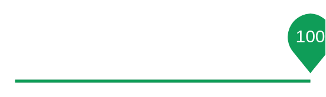

# Discrete slider (focused) 3

## Definition

```
{
  _style: 'dashed=0;verticalLabelPosition=bottom;verticalAlign=top;align=center;shape=mxgraph.gmdl.sliderDiscrete;barPos=100;strokeColor=#0F9D58;opacity=100;strokeWidth=2;fillColor=#0F9D58;handleSize=10;shadow=0;fontSize=12;fontColor=#ffffff;html=1;',
  _width: 200,
  _height: 45,
}
```

## Usage

```
import { DiscreteSliderFocused3 } from '@reactiac/standard-components-diagrams/gmdlSliders'

<DiscreteSliderFocused3/>
```

## Preview


