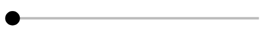

# Discrete slider (normal, light)

## Definition

```
{
  _style: 'dashed=0;verticalLabelPosition=bottom;verticalAlign=top;align=center;shape=mxgraph.gmdl.slider2;barPos=0;opacity=100;strokeWidth=2;fillColor=#000000;handleSize=10;shadow=0;html=1;',
  _width: 200,
  _height: 10,
}
```

## Usage

```
import { DiscreteSliderNormalLight } from '@reactiac/standard-components-diagrams/gmdlSliders'

<DiscreteSliderNormalLight/>
```

## Preview


