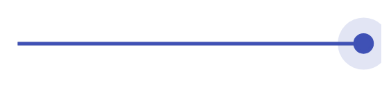

# Slider (focused) 3

## Definition

```
{
  _style: { 
    entity: 'dashed=0;verticalLabelPosition=bottom;verticalAlign=top;align=center;shape=mxgraph.gmdl.sliderFocused;barPos=100;strokeColor=#3F51B5;opacity=100;strokeWidth=2;fillColor=#3F51B5;handleSize=30;shadow=0;html=1;',
  },
  _width: 200,
  _height: 30,
}
```

## Usage

```
import { SliderFocused3 } from '@diac/standard-components-diagrams/gmdlSliders'

<SliderFocused3/>
```

## Preview


