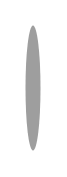

# Stepper with alternative label placing 5

## Definition

```
{
  _style: 'shape=ellipse;fontSize=12;strokeColor=none;fillColor=#9e9e9e;fontColor=#ffffff;html=1;',
  _width: 6,
  _height: 50,
}
```

## Usage

```
import { StepperWithAlternativeLabelPlacing5 } from '@diac/standard-components-diagrams/gmdlSteppers'

<StepperWithAlternativeLabelPlacing5/>
```

## Preview


