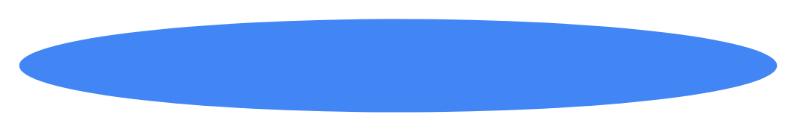

# Stepper with alternative label placing

## Definition

```
{
  _style: 'shape=ellipse;fontSize=12;strokeColor=none;fillColor=#4285F4;fontColor=#ffffff;align=center;verticalAlign=middle;html=1;',
  _width: 404,
  _height: 50,
}
```

## Usage

```
import { StepperWithAlternativeLabelPlacing } from '@diac/standard-components-diagrams/gmdlSteppers'

<StepperWithAlternativeLabelPlacing/>
```

## Preview


