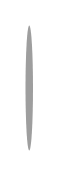

# Stepper with alternative optional label placing 2

## Definition

```
{
  _style: { 
    entity: 'shape=ellipse;strokeColor=none;fillColor=#9e9e9e;fontColor=#ffffff;fontSize=12;align=center;verticalAlign=middle;html=1;',
  },
  _original_width: 3,
  _original_height: 50,
}
```

## Usage

```
import { StepperWithAlternativeOptionalLabelPlacing2 } from '@dinghy/standard-components-diagrams/gmdlSteppers'

<StepperWithAlternativeOptionalLabelPlacing2/>
```

## Preview


