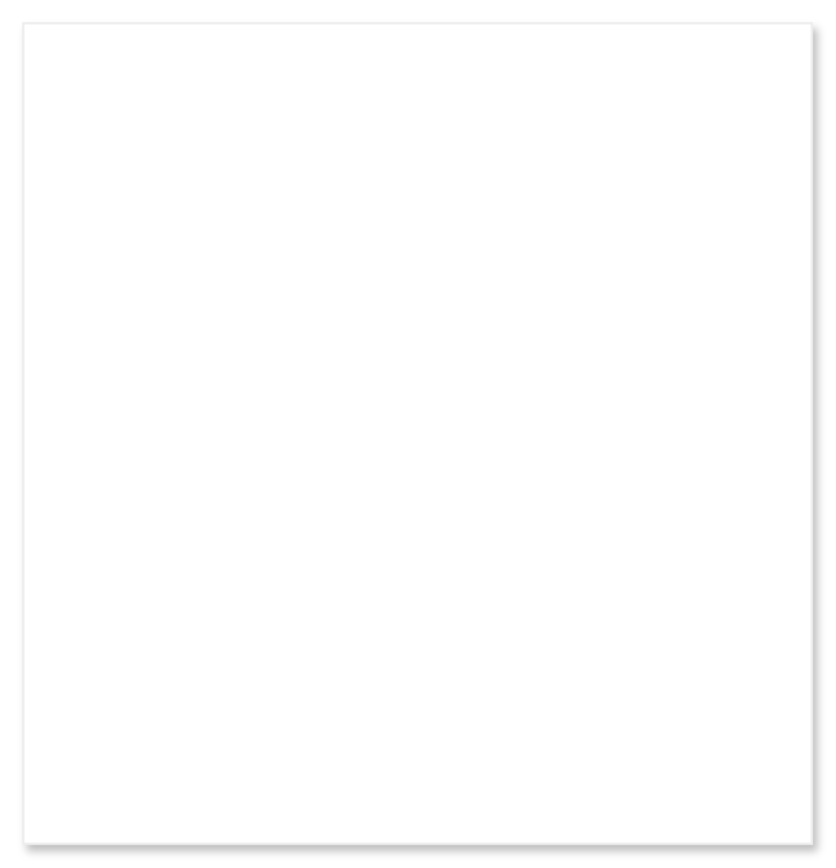

# Single-line text field

## Definition

```
{
  _style: 'dashed=0;shape=rect;fillColor=#ffffff;strokeColor=#eeeeee;shadow=1;',
  _width: 346,
  _height: 360,
}
```

## Usage

```
import { SingleLineTextField } from '@reactiac/standard-components-diagrams/gmdlTextFields'

<SingleLineTextField/>
```

## Preview


