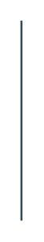

# Bar Graph 12

## Definition

```
{
  _style: 'verticalLabelPosition=bottom;verticalAlign=top;html=1;shape=mxgraph.infographic.shadedCube;isoAngle=15;fillColor=#23445D;strokeColor=none;shadow=0;',
  _width: 1,
  _height: 100,
}
```

## Usage

```
import { BarGraph12 } from '@reactiac/standard-components-diagrams/infoGraphic'

<BarGraph12/>
```

## Preview


