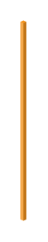

# Bar Graph 14

## Definition

```
{
  _style: 'verticalLabelPosition=bottom;verticalAlign=top;html=1;shape=mxgraph.infographic.shadedCube;isoAngle=15;fillColor=#F2931E;strokeColor=none;shadow=0;',
  _width: 3,
  _height: 100,
}
```

## Usage

```
import { BarGraph14 } from '@reactiac/standard-components-diagrams/infoGraphic'

<BarGraph14/>
```

## Preview


