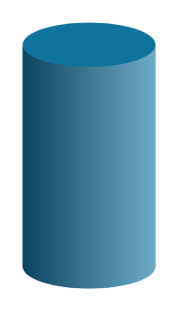

# Bar Graph 16

## Definition

```
{
  _style: { 
    entity: 'verticalLabelPosition=bottom;verticalAlign=top;html=1;shape=mxgraph.infographic.cylinder;isoAngle=15;fillColor=#10739E;strokeColor=none;fontStyle=1;fontColor=#10739E;fontSize=12;shadow=0;',
  },
  _original_width: 0,
  _original_height: 120,
}
```

## Usage

```
import { BarGraph16 } from '@dinghy/standard-components-diagrams/infoGraphic'

<BarGraph16/>
```

## Preview


