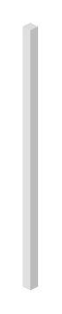

# Bar Graph 8

## Definition

```
{
  _style: { 
    entity: 'verticalLabelPosition=top;verticalAlign=bottom;html=1;shape=mxgraph.infographic.shadedCube;isoAngle=15;fillColor=#CCCCCC;strokeColor=none;fontStyle=1;fontColor=#D82A23;fontSize=12;shadow=0;align=left;opacity=70;',
  },
  _original_width: 7,
  _original_height: 120,
}
```

## Usage

```
import { BarGraph8 } from '@diac/standard-components-diagrams/infoGraphic'

<BarGraph8/>
```

## Preview


