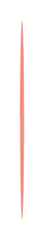

# Circular Dial List (horizontal) 3

## Definition

```
{
  _style: 'verticalLabelPosition=bottom;verticalAlign=top;html=1;shape=mxgraph.basic.donut;dx=10;strokeColor=none;fillColor=#F08E81;fontSize=12;fontColor=#AE4132;align=center;fontStyle=1;',
  _width: 2,
  _height: 100,
}
```

## Usage

```
import { CircularDialListHorizontal3 } from '@reactiac/standard-components-diagrams/infoGraphic'

<CircularDialListHorizontal3/>
```

## Preview


