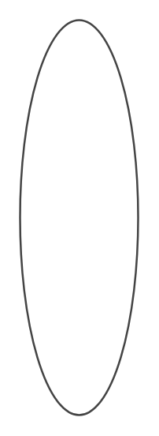

# Other Infographic Entities

- [AngledEntry](./angled-entry.md)  

- [AngledEntry2](./angled-entry-2.md)  

- [AngledList](./angled-list.md)  

- [AngledList10](./angled-list-10.md)  

- [AngledList2](./angled-list-2.md)  

- [AngledList3](./angled-list-3.md)  

- [AngledList4](./angled-list-4.md)  

- [AngledList5](./angled-list-5.md)  

- [AngledList6](./angled-list-6.md)  

- [AngledList7](./angled-list-7.md)  

- [AngledList8](./angled-list-8.md)  

- [AngledList9](./angled-list-9.md)  

- [Arc](./arc.md)  

- [ArcList](./arc-list.md)  

- [ArcList10](./arc-list-10.md)  

- [ArcList11](./arc-list-11.md)  

- [ArcList12](./arc-list-12.md)  

- [ArcList13](./arc-list-13.md)  

- [ArcList2](./arc-list-2.md)  

- [ArcList3](./arc-list-3.md)  

- [ArcList4](./arc-list-4.md)  

- [ArcList5](./arc-list-5.md)  

- [ArcList6](./arc-list-6.md)  

- [ArcList7](./arc-list-7.md)  

- [ArcList8](./arc-list-8.md)  

- [ArcList9](./arc-list-9.md)  

- [ArrowGraph](./arrow-graph.md)  

- [ArrowGraph2](./arrow-graph-2.md)  

- [ArrowGraph3](./arrow-graph-3.md)  

- [ArrowGraph4](./arrow-graph-4.md)  

- [ArrowGraph5](./arrow-graph-5.md)  

- [ArrowList](./arrow-list.md)  

- [ArrowList10](./arrow-list-10.md)  

- [ArrowList2](./arrow-list-2.md)  

- [ArrowList3](./arrow-list-3.md)  

- [ArrowList4](./arrow-list-4.md)  

- [ArrowList5](./arrow-list-5.md)  

- [ArrowList6](./arrow-list-6.md)  

- [ArrowList7](./arrow-list-7.md)  

- [ArrowList8](./arrow-list-8.md)  

- [ArrowList9](./arrow-list-9.md)  

- [Banner](./banner.md)  

- [BannerHalfFold](./banner-half-fold.md)  

- [BannerSingleFold](./banner-single-fold.md)  

- [BarGraph](./bar-graph.md)  

- [BarGraph10](./bar-graph-10.md)  

- [BarGraph11](./bar-graph-11.md)  

- [BarGraph12](./bar-graph-12.md)  

- [BarGraph13](./bar-graph-13.md)  

- [BarGraph14](./bar-graph-14.md)  

- [BarGraph15](./bar-graph-15.md)  

- [BarGraph16](./bar-graph-16.md)  

- [BarGraph17](./bar-graph-17.md)  

- [BarGraph18](./bar-graph-18.md)  

- [BarGraph19](./bar-graph-19.md)  

- [BarGraph2](./bar-graph-2.md)  

- [BarGraph20](./bar-graph-20.md)  

- [BarGraph21](./bar-graph-21.md)  

- [BarGraph22](./bar-graph-22.md)  

- [BarGraph23](./bar-graph-23.md)  

- [BarGraph24](./bar-graph-24.md)  

- [BarGraph25](./bar-graph-25.md)  

- [BarGraph26](./bar-graph-26.md)  

- [BarGraph27](./bar-graph-27.md)  

- [BarGraph28](./bar-graph-28.md)  

- [BarGraph29](./bar-graph-29.md)  

- [BarGraph3](./bar-graph-3.md)  

- [BarGraph30](./bar-graph-30.md)  

- [BarGraph31](./bar-graph-31.md)  

- [BarGraph32](./bar-graph-32.md)  

- [BarGraph33](./bar-graph-33.md)  

- [BarGraph34](./bar-graph-34.md)  

- [BarGraph35](./bar-graph-35.md)  

- [BarGraph4](./bar-graph-4.md)  

- [BarGraph5](./bar-graph-5.md)  

- [BarGraph6](./bar-graph-6.md)  

- [BarGraph7](./bar-graph-7.md)  

- [BarGraph8](./bar-graph-8.md)  

- [BarGraph9](./bar-graph-9.md)  

- [BarWithCallout](./bar-with-callout.md)  

- [BendingArch](./bending-arch.md)  

- [Callout](./callout.md)  

- [ChangeGraph](./change-graph.md)  

- [ChangeGraph2](./change-graph-2.md)  

- [ChangeGraph3](./change-graph-3.md)  

- [ChangeGraph4](./change-graph-4.md)  

- [ChangeGraph5](./change-graph-5.md)  

- [ChevronList](./chevron-list.md)  

- [ChevronList10](./chevron-list-10.md)  

- [ChevronList11](./chevron-list-11.md)  

- [ChevronList12](./chevron-list-12.md)  

- [ChevronList2](./chevron-list-2.md)  

- [ChevronList3](./chevron-list-3.md)  

- [ChevronList4](./chevron-list-4.md)  

- [ChevronList5](./chevron-list-5.md)  

- [ChevronList6](./chevron-list-6.md)  

- [ChevronList7](./chevron-list-7.md)  

- [ChevronList8](./chevron-list-8.md)  

- [ChevronList9](./chevron-list-9.md)  

- [CircularCallout](./circular-callout.md)  

- [CircularCallout2](./circular-callout-2.md)  

- [CircularDial](./circular-dial.md)  

- [CircularDial2](./circular-dial-2.md)  

- [CircularDialListHorizontal](./circular-dial-list-horizontal.md)  

- [CircularDialListHorizontal10](./circular-dial-list-horizontal-10.md)  

- [CircularDialListHorizontal11](./circular-dial-list-horizontal-11.md)  

- [CircularDialListHorizontal12](./circular-dial-list-horizontal-12.md)  

- [CircularDialListHorizontal13](./circular-dial-list-horizontal-13.md)  

- [CircularDialListHorizontal14](./circular-dial-list-horizontal-14.md)  

- [CircularDialListHorizontal15](./circular-dial-list-horizontal-15.md)  

- [CircularDialListHorizontal16](./circular-dial-list-horizontal-16.md)  

- [CircularDialListHorizontal2](./circular-dial-list-horizontal-2.md)  

- [CircularDialListHorizontal3](./circular-dial-list-horizontal-3.md)  

- [CircularDialListHorizontal4](./circular-dial-list-horizontal-4.md)  

- [CircularDialListHorizontal5](./circular-dial-list-horizontal-5.md)  

- [CircularDialListHorizontal6](./circular-dial-list-horizontal-6.md)  

- [CircularDialListHorizontal7](./circular-dial-list-horizontal-7.md)  

- [CircularDialListHorizontal8](./circular-dial-list-horizontal-8.md)  

- [CircularDialListHorizontal9](./circular-dial-list-horizontal-9.md)  

- [CircularDialListVertical](./circular-dial-list-vertical.md)  

- [CircularDialListVertical2](./circular-dial-list-vertical-2.md)  

- [CircularDialListVertical3](./circular-dial-list-vertical-3.md)  

- [CircularDialListVertical4](./circular-dial-list-vertical-4.md)  

- [CircularDialListVertical5](./circular-dial-list-vertical-5.md)  

- [CircularDialListVertical6](./circular-dial-list-vertical-6.md)  

- [Cube](./cube.md)  

- [Cylinder](./cylinder.md)  

- [CylinderGraph](./cylinder-graph.md)  

- [CylinderGraph10](./cylinder-graph-10.md)  

- [CylinderGraph11](./cylinder-graph-11.md)  

- [CylinderGraph2](./cylinder-graph-2.md)  

- [CylinderGraph3](./cylinder-graph-3.md)  

- [CylinderGraph4](./cylinder-graph-4.md)  

- [CylinderGraph5](./cylinder-graph-5.md)  

- [CylinderGraph6](./cylinder-graph-6.md)  

- [CylinderGraph7](./cylinder-graph-7.md)  

- [CylinderGraph8](./cylinder-graph-8.md)  

- [CylinderGraph9](./cylinder-graph-9.md)  

- [Flag](./flag.md)  

- [Flower](./flower.md)  

- [Flower2](./flower-2.md)  

- [Flower3](./flower-3.md)  

- [Flower4](./flower-4.md)  

- [FoldedBanners](./folded-banners.md)  

- [FoldedBanners2](./folded-banners-2.md)  

- [FoldedBanners3](./folded-banners-3.md)  

- [FoldedBanners4](./folded-banners-4.md)  

- [HexLoop](./hex-loop.md)  

- [HexLoop2](./hex-loop-2.md)  

- [HexLoop3](./hex-loop-3.md)  

- [HexLoop4](./hex-loop-4.md)  

- [HexLoop5](./hex-loop-5.md)  

- [HexLoop6](./hex-loop-6.md)  

- [HexLoop7](./hex-loop-7.md)  

- [List](./list.md)  

- [List2](./list-2.md)  

- [List3](./list-3.md)  

- [List4](./list-4.md)  

- [List5](./list-5.md)  

- [Matrix2x2](./matrix-2x2.md)  

- [Matrix2x210](./matrix-2x2-10.md)  

- [Matrix2x211](./matrix-2x2-11.md)  

- [Matrix2x212](./matrix-2x2-12.md)  

- [Matrix2x22](./matrix-2x2-2.md)  

- [Matrix2x23](./matrix-2x2-3.md)  

- [Matrix2x24](./matrix-2x2-4.md)  

- [Matrix2x25](./matrix-2x2-5.md)  

- [Matrix2x26](./matrix-2x2-6.md)  

- [Matrix2x27](./matrix-2x2-7.md)  

- [Matrix2x28](./matrix-2x2-8.md)  

- [Matrix2x29](./matrix-2x2-9.md)  

- [Matrix3x3](./matrix-3x3.md)  

- [Matrix3x32](./matrix-3x3-2.md)  

- [Matrix3x33](./matrix-3x3-3.md)  

- [Matrix3x34](./matrix-3x3-4.md)  

- [Matrix3x35](./matrix-3x3-5.md)  

- [Matrix3x36](./matrix-3x3-6.md)  

- [Matrix3x37](./matrix-3x3-7.md)  

- [NumberedEntry](./numbered-entry.md)  

- [NumberedEntryVertical](./numbered-entry-vertical.md)  

- [NumberedEntry2](./numbered-entry-2.md)  

- [NumberedList](./numbered-list.md)  

- [NumberedList2](./numbered-list-2.md)  

- [NumberedList3](./numbered-list-3.md)  

- [NumberedList4](./numbered-list-4.md)  

- [NumberedList5](./numbered-list-5.md)  

- [NumberedList6](./numbered-list-6.md)  

- [NumberedList7](./numbered-list-7.md)  

- [NumberedList8](./numbered-list-8.md)  

- [NumberedList9](./numbered-list-9.md)  

- [Onion](./onion.md)  

- [PartialConcentricEllipse](./partial-concentric-ellipse.md)  

- [PartialConcentricEllipse2](./partial-concentric-ellipse-2.md)  

- [PercentageList](./percentage-list.md)  

- [PercentageList10](./percentage-list-10.md)  

- [PercentageList11](./percentage-list-11.md)  

- [PercentageList12](./percentage-list-12.md)  

- [PercentageList13](./percentage-list-13.md)  

- [PercentageList14](./percentage-list-14.md)  

- [PercentageList15](./percentage-list-15.md)  

- [PercentageList16](./percentage-list-16.md)  

- [PercentageList2](./percentage-list-2.md)  

- [PercentageList3](./percentage-list-3.md)  

- [PercentageList4](./percentage-list-4.md)  

- [PercentageList5](./percentage-list-5.md)  

- [PercentageList6](./percentage-list-6.md)  

- [PercentageList7](./percentage-list-7.md)  

- [PercentageList8](./percentage-list-8.md)  

- [PercentageList9](./percentage-list-9.md)  

- [Pie](./pie.md)  

- [Pyramid](./pyramid.md)  

- [PyramidGraph](./pyramid-graph.md)  

- [PyramidGraph2](./pyramid-graph-2.md)  

- [PyramidGraph3](./pyramid-graph-3.md)  

- [PyramidGraph4](./pyramid-graph-4.md)  

- [PyramidGraph5](./pyramid-graph-5.md)  

- [PyramidStep](./pyramid-step.md)  

- [Ribbon](./ribbon.md)  

- [RibbonBackFolded](./ribbon-back-folded.md)  

- [RibbonDoubleFolded](./ribbon-double-folded.md)  

- [RibbonFrontFolded](./ribbon-front-folded.md)  

- [RibbonRolled](./ribbon-rolled.md)  

- [RibbonList](./ribbon-list.md)  

- [RibbonList2](./ribbon-list-2.md)  

- [RibbonList3](./ribbon-list-3.md)  

- [RibbonList4](./ribbon-list-4.md)  

- [RibbonList5](./ribbon-list-5.md)  

- [RibbonList6](./ribbon-list-6.md)  

- [RibbonList7](./ribbon-list-7.md)  

- [RoadmapDiagonal](./roadmap-diagonal.md)  

- [RoadmapDiagonal10](./roadmap-diagonal-10.md)  

- [RoadmapDiagonal11](./roadmap-diagonal-11.md)  

- [RoadmapDiagonal2](./roadmap-diagonal-2.md)  

- [RoadmapDiagonal3](./roadmap-diagonal-3.md)  

- [RoadmapDiagonal4](./roadmap-diagonal-4.md)  

- [RoadmapDiagonal5](./roadmap-diagonal-5.md)  

- [RoadmapDiagonal6](./roadmap-diagonal-6.md)  

- [RoadmapDiagonal7](./roadmap-diagonal-7.md)  

- [RoadmapDiagonal8](./roadmap-diagonal-8.md)  

- [RoadmapDiagonal9](./roadmap-diagonal-9.md)  

- [RoadmapHorizontal](./roadmap-horizontal.md)  

- [RoadmapHorizontal10](./roadmap-horizontal-10.md)  

- [RoadmapHorizontal11](./roadmap-horizontal-11.md)  

- [RoadmapHorizontal12](./roadmap-horizontal-12.md)  

- [RoadmapHorizontal13](./roadmap-horizontal-13.md)  

- [RoadmapHorizontal14](./roadmap-horizontal-14.md)  

- [RoadmapHorizontal15](./roadmap-horizontal-15.md)  

- [RoadmapHorizontal16](./roadmap-horizontal-16.md)  

- [RoadmapHorizontal2](./roadmap-horizontal-2.md)  

- [RoadmapHorizontal3](./roadmap-horizontal-3.md)  

- [RoadmapHorizontal4](./roadmap-horizontal-4.md)  

- [RoadmapHorizontal5](./roadmap-horizontal-5.md)  

- [RoadmapHorizontal6](./roadmap-horizontal-6.md)  

- [RoadmapHorizontal7](./roadmap-horizontal-7.md)  

- [RoadmapHorizontal8](./roadmap-horizontal-8.md)  

- [RoadmapHorizontal9](./roadmap-horizontal-9.md)  

- [RoadmapVertical](./roadmap-vertical.md)  

- [RoadmapVertical10](./roadmap-vertical-10.md)  

- [RoadmapVertical11](./roadmap-vertical-11.md)  

- [RoadmapVertical12](./roadmap-vertical-12.md)  

- [RoadmapVertical13](./roadmap-vertical-13.md)  

- [RoadmapVertical14](./roadmap-vertical-14.md)  

- [RoadmapVertical15](./roadmap-vertical-15.md)  

- [RoadmapVertical16](./roadmap-vertical-16.md)  

- [RoadmapVertical17](./roadmap-vertical-17.md)  

- [RoadmapVertical18](./roadmap-vertical-18.md)  

- [RoadmapVertical19](./roadmap-vertical-19.md)  

- [RoadmapVertical2](./roadmap-vertical-2.md)  

- [RoadmapVertical20](./roadmap-vertical-20.md)  

- [RoadmapVertical21](./roadmap-vertical-21.md)  

- [RoadmapVertical3](./roadmap-vertical-3.md)  

- [RoadmapVertical4](./roadmap-vertical-4.md)  

- [RoadmapVertical5](./roadmap-vertical-5.md)  

- [RoadmapVertical6](./roadmap-vertical-6.md)  

- [RoadmapVertical7](./roadmap-vertical-7.md)  

- [RoadmapVertical8](./roadmap-vertical-8.md)  

- [RoadmapVertical9](./roadmap-vertical-9.md)  

- [Roll](./roll.md)  

- [Roll10](./roll-10.md)  

- [Roll11](./roll-11.md)  

- [Roll12](./roll-12.md)  

- [Roll13](./roll-13.md)  

- [Roll14](./roll-14.md)  

- [Roll2](./roll-2.md)  

- [Roll3](./roll-3.md)  

- [Roll4](./roll-4.md)  

- [Roll5](./roll-5.md)  

- [Roll6](./roll-6.md)  

- [Roll7](./roll-7.md)  

- [Roll8](./roll-8.md)  

- [Roll9](./roll-9.md)  

- [StepPyramid](./step-pyramid.md)  

- [StepPyramid2](./step-pyramid-2.md)  

- [StepPyramid3](./step-pyramid-3.md)  

- [StepPyramid4](./step-pyramid-4.md)  

- [StepPyramid5](./step-pyramid-5.md)  

- [StepPyramid6](./step-pyramid-6.md)  

- [StepPyramid7](./step-pyramid-7.md)  

- [StepPyramid8](./step-pyramid-8.md)  

- [Swirl](./swirl.md)  

- [Swirl10](./swirl-10.md)  

- [Swirl11](./swirl-11.md)  

- [Swirl12](./swirl-12.md)  

- [Swirl13](./swirl-13.md)  

- [Swirl14](./swirl-14.md)  

- [Swirl15](./swirl-15.md)  

- [Swirl16](./swirl-16.md)  

- [Swirl17](./swirl-17.md)  

- [Swirl18](./swirl-18.md)  

- [Swirl19](./swirl-19.md)  

- [Swirl2](./swirl-2.md)  

- [Swirl20](./swirl-20.md)  

- [Swirl21](./swirl-21.md)  

- [Swirl3](./swirl-3.md)  

- [Swirl4](./swirl-4.md)  

- [Swirl5](./swirl-5.md)  

- [Swirl6](./swirl-6.md)  

- [Swirl7](./swirl-7.md)  

- [Swirl8](./swirl-8.md)  

- [Swirl9](./swirl-9.md)  

- [Target](./target.md)  

- [TargetSimple](./target-simple.md)  

- [TargetSimple2](./target-simple-2.md)  

- [Target2](./target-2.md)  

- [Target3](./target-3.md)  

- [Target4](./target-4.md)  

- [Target5](./target-5.md)  

- [Target6](./target-6.md)  

- [Target7](./target-7.md)  

- [Trapezoid](./trapezoid.md)  

- [Triangle](./triangle.md)  

- [TriangleSimple](./triangle-simple.md)  

- [TriangleSimple2](./triangle-simple-2.md)  

- [TriangleSimple3](./triangle-simple-3.md)  

- [TriangleSimple4](./triangle-simple-4.md)  

- [Triangle2](./triangle-2.md)  

- [Triangle3](./triangle-3.md)  

- [Triangle4](./triangle-4.md)  

- [Triangle5](./triangle-5.md)  

- [Triangle6](./triangle-6.md)  

- [Triangle7](./triangle-7.md)  

- [Triangle8](./triangle-8.md)  

- [TriangleGraph](./triangle-graph.md)  

- [TriangleGraph2](./triangle-graph-2.md)  

- [TriangleGraph3](./triangle-graph-3.md)  

- [TriangleGraph4](./triangle-graph-4.md)  

- [TriangleGraph5](./triangle-graph-5.md)  

- [TriangularDiagram](./triangular-diagram.md)  

- [TriangularDiagram2](./triangular-diagram-2.md)  

- [TriangularDiagram3](./triangular-diagram-3.md)  

- [TriangularDiagram4](./triangular-diagram-4.md)  

