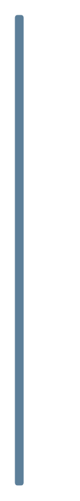

# Numbered List 6

## Definition

```
{
  _style: 'shape=rect;rounded=1;whiteSpace=wrap;html=1;shadow=0;strokeColor=none;fillColor=#5D7F99;arcSize=30;fontSize=14;spacingLeft=42;fontStyle=1;fontColor=#FFFFFF;align=left;',
  _width: 6,
  _height: 320,
}
```

## Usage

```
import { NumberedList6 } from '@reactiac/standard-components-diagrams/infoGraphic'

<NumberedList6/>
```

## Preview


