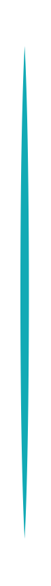

# Numbered List 9

## Definition

```
{
  _style: 'shape=ellipse;perimeter=ellipsePerimeter;fontSize=22;fontStyle=1;shadow=0;strokeColor=#ffffff;fillColor=#12AAB5;strokeWidth=4;fontColor=#ffffff;align=center;whiteSpace=wrap;html=1;',
  _width: 9,
  _height: 320,
}
```

## Usage

```
import { NumberedList9 } from '@reactiac/standard-components-diagrams/infoGraphic'

<NumberedList9/>
```

## Preview


