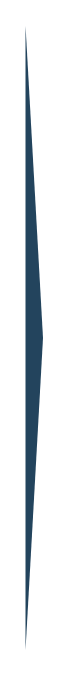

# Percentage list 14

## Definition

```
{
  _style: 'html=1;shape=mxgraph.infographic.ribbonSimple;notch1=0;notch2=20;fillColor=#23445D;strokeColor=none;align=left;verticalAlign=middle;fontColor=#ffffff;fontSize=18;spacingLeft=10;fontStyle=1;shadow=0;',
  _width: 7,
  _height: 250,
}
```

## Usage

```
import { PercentageList14 } from '@reactiac/standard-components-diagrams/infoGraphic'

<PercentageList14/>
```

## Preview


