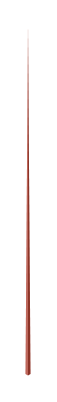

# Pyramid Graph 3

## Definition

```
{
  _style: { 
    entity: 'verticalLabelPosition=bottom;verticalAlign=top;html=1;shape=mxgraph.infographic.shadedPyramid;fillColor=#AE4132;strokeColor=none;fontSize=10;labelPosition=center;align=center;shadow=0;',
  },
  _original_width: 2,
  _original_height: 140,
}
```

## Usage

```
import { PyramidGraph3 } from '@dinghy/standard-components-diagrams/infoGraphic'

<PyramidGraph3/>
```

## Preview


