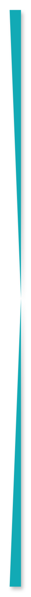

# Ribbon List 7

## Definition

```
{
  _style: 'html=1;shape=mxgraph.infographic.ribbonSimple;notch1=20;notch2=0;fillColor=#12AAB5;strokeColor=none;shadow=1;',
  _width: 12,
  _height: 590,
}
```

## Usage

```
import { RibbonList7 } from '@reactiac/standard-components-diagrams/infoGraphic'

<RibbonList7/>
```

## Preview


