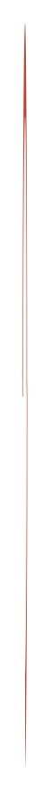

# Roadmap (diagonal) 3

## Definition

```
{
  _style: { 
    entity: 'verticalLabelPosition=bottom;verticalAlign=top;html=1;shape=mxgraph.basic.partConcEllipse;startAngle=0.75;endAngle=0.5;arcWidth=0.25;fillColor=#AE4132;strokeColor=none;shadow=0;',
  },
  _original_width: 2,
  _original_height: 330,
}
```

## Usage

```
import { RoadmapDiagonal3 } from '@diac/standard-components-diagrams/infoGraphic'

<RoadmapDiagonal3/>
```

## Preview


