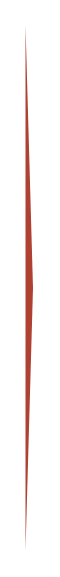

# Roadmap (horizontal) 14

## Definition

```
{
  _style: 'shape=mxgraph.infographic.ribbonSimple;notch1=0;notch2=10;notch=0;html=1;fillColor=#AE4132;strokeColor=none;shadow=0;fontSize=17;fontColor=#FFFFFF;align=left;spacingLeft=10;fontStyle=1;whiteSpace=wrap;',
  _width: 3,
  _height: 210,
}
```

## Usage

```
import { RoadmapHorizontal14 } from '@reactiac/standard-components-diagrams/infoGraphic'

<RoadmapHorizontal14/>
```

## Preview


