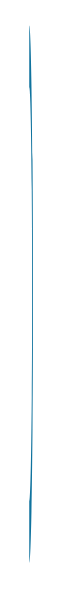

# Swirl 10

## Definition

```
{
  _style: { 
    entity: 'verticalLabelPosition=bottom;verticalAlign=top;html=1;shape=mxgraph.basic.partConcEllipse;fillColor=#10739E;strokeColor=none;startAngle=0;endAngle=0.5;arcWidth=0.23;shadow=0;fontSize=7;fontColor=#FFFFFF;align=left;',
  },
  _original_width: 3,
  _original_height: 215,
}
```

## Usage

```
import { Swirl10 } from '@diac/standard-components-diagrams/infoGraphic'

<Swirl10/>
```

## Preview


