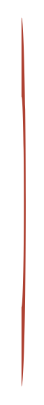

# Swirl 12

## Definition

```
{
  _style: 'verticalLabelPosition=bottom;verticalAlign=top;html=1;shape=mxgraph.basic.partConcEllipse;fillColor=#AE4132;strokeColor=none;startAngle=0;endAngle=0.5;arcWidth=0.43;shadow=0;fontSize=7;fontColor=#FFFFFF;align=left;',
  _width: 5,
  _height: 215,
}
```

## Usage

```
import { Swirl12 } from '@reactiac/standard-components-diagrams/infoGraphic'

<Swirl12/>
```

## Preview


