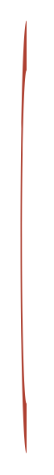

# Swirl 13

## Definition

```
{
  _style: { 
    entity: 'verticalLabelPosition=bottom;verticalAlign=top;html=1;shape=mxgraph.basic.partConcEllipse;fillColor=#AE4132;strokeColor=none;startAngle=0.5;endAngle=0.00001;arcWidth=0.23;shadow=0;fontSize=7;fontColor=#FFFFFF;align=left;',
  },
  _original_width: 6,
  _original_height: 215,
}
```

## Usage

```
import { Swirl13 } from '@dinghy/standard-components-diagrams/infoGraphic'

<Swirl13/>
```

## Preview


