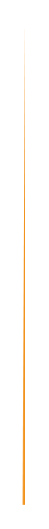

# Swirl 8

## Definition

```
{
  _style: 'shape=manualInput;whiteSpace=wrap;html=1;shadow=0;fillColor=#F2931E;strokeColor=none;fontSize=12;fontColor=#FFFFFF;align=center;direction=north;flipV=1;rounded=0;',
  _width: 1,
  _height: 215,
}
```

## Usage

```
import { Swirl8 } from '@reactiac/standard-components-diagrams/infoGraphic'

<Swirl8/>
```

## Preview


