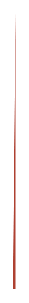

# Swirl 9

## Definition

```
{
  _style: 'shape=manualInput;whiteSpace=wrap;html=1;shadow=0;fillColor=#AE4132;strokeColor=none;fontSize=12;fontColor=#FFFFFF;align=center;direction=north;flipV=1;rounded=0;',
  _width: 2,
  _height: 215,
}
```

## Usage

```
import { Swirl9 } from '@diac/standard-components-diagrams/infoGraphic'

<Swirl9/>
```

## Preview


