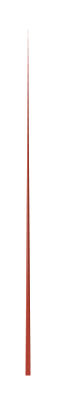

# Triangle Graph 3

## Definition

```
{
  _style: 'verticalLabelPosition=middle;verticalAlign=bottom;html=1;whiteSpace=wrap;shape=mxgraph.infographic.shadedTriangle;fillColor=#AE4132;strokeColor=none;fontSize=10;labelPosition=center;align=center;fontColor=#FFFFFF;fontStyle=1;shadow=0;',
  _width: 2,
  _height: 140,
}
```

## Usage

```
import { TriangleGraph3 } from '@reactiac/standard-components-diagrams/infoGraphic'

<TriangleGraph3/>
```

## Preview


