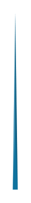

# Triangle Graph 5

## Definition

```
{
  _style: { 
    entity: 'verticalLabelPosition=middle;verticalAlign=bottom;html=1;whiteSpace=wrap;shape=mxgraph.infographic.shadedTriangle;fillColor=#10739E;strokeColor=none;fontSize=10;labelPosition=center;align=center;fontColor=#FFFFFF;fontStyle=1;shadow=0;',
  },
  _original_width: 4,
  _original_height: 140,
}
```

## Usage

```
import { TriangleGraph5 } from '@dinghy/standard-components-diagrams/infoGraphic'

<TriangleGraph5/>
```

## Preview


