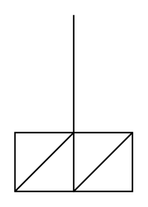

# Agitator (Gat Paddle)

## Definition

```
{
  _style: 'shape=mxgraph.pid.agitators.agitator_(gat_paddle);html=1;pointerEvents=1;align=center;verticalLabelPosition=bottom;verticalAlign=top;dashed=0;',
  _width: 80,
  _height: 120,
}
```

## Usage

```
import { AgitatorGatPaddle } from '@diac/standard-components-diagrams/procEngAgitators'

<AgitatorGatPaddle/>
```

## Preview


