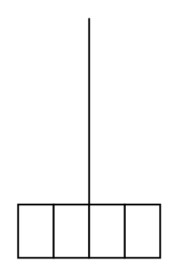

# Agitator (Turbine)

## Definition

```
{
  _style: 'shape=mxgraph.pid.agitators.agitator_(turbine);html=1;pointerEvents=1;align=center;verticalLabelPosition=bottom;verticalAlign=top;dashed=0;',
  _width: 80,
  _height: 135,
}
```

## Usage

```
import { AgitatorTurbine } from '@reactiac/standard-components-diagrams/procEngAgitators'

<AgitatorTurbine/>
```

## Preview


