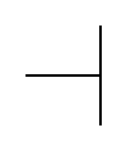
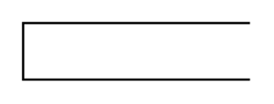
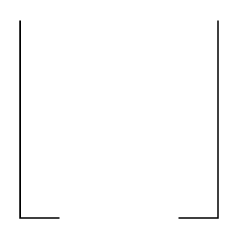

# Proc Eng Apparatus Elements Entities

- [Manhole](./manhole.md)  

- [SocketConnectionNozzle](./socket-connection-nozzle.md)  

- [SupportBracket](./support-bracket.md)  

- [SupportLeg](./support-leg.md)  

- [SupportRing](./support-ring.md)  

- [SupportSkirt](./support-skirt.md)  

