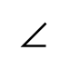

# Support Bracket

## Definition

```
{
  _style: { 
    entity: 'shape=mxgraph.pid.apparatus_elements.support_bracket;html=1;pointerEvents=1;align=center;verticalLabelPosition=bottom;verticalAlign=top;dashed=0;',
  },
  _width: 10,
  _height: 10,
}
```

## Usage

```
import { SupportBracket } from '@diac/standard-components-diagrams/procEngApparatusElements'

<SupportBracket/>
```

## Preview


