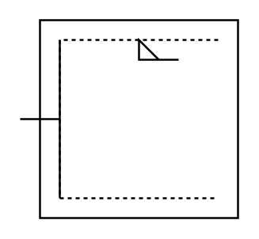

# Centrifuge (Skimmer)

## Definition

```
{
  _style: { 
    entity: 'shape=mxgraph.pid.centrifuges.centrifuge_(skimmer);html=1;pointerEvents=1;align=center;verticalLabelPosition=bottom;verticalAlign=top;dashed=0;',
  },
  _original_width: 110,
  _original_height: 100,
}
```

## Usage

```
import { CentrifugeSkimmer } from '@diac/standard-components-diagrams/procEngCentrifuges'

<CentrifugeSkimmer/>
```

## Preview


