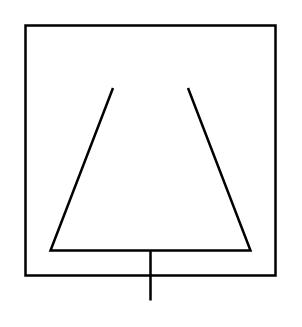
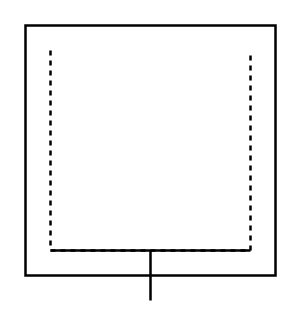
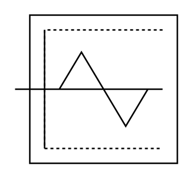
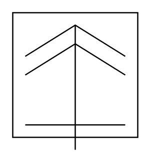
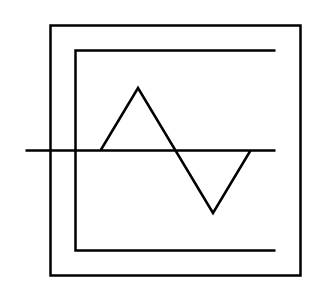

# Proc Eng Centrifuges Entities

- [CentrifugeHighSpeed](./centrifuge-high-speed.md)  

- [CentrifugePerforatedShell](./centrifuge-perforated-shell.md)  

- [CentrifugePusher](./centrifuge-pusher.md)  

- [CentrifugeScrewPerforatedShell](./centrifuge-screw-perforated-shell.md)  

- [CentrifugeSeparatorDisc](./centrifuge-separator-disc.md)  

- [CentrifugeSkimmer](./centrifuge-skimmer.md)  

- [CentrifugeSolidShell](./centrifuge-solid-shell.md)  

- [CentrifugeDecanterScrewSolidShell](./centrifuge-decanter-screw-solid-shell.md)  

