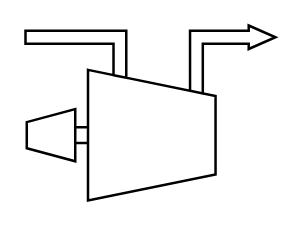

# Centrifugal Compressor - Turbine Driven

## Definition

```
{
  _style: { 
    entity: 'shape=mxgraph.pid.compressors.centrifugal_compressor_-_turbine_driven;dashed=0;fontSize=8;html=1;overflow=fill;',
  },
  _original_width: 100,
  _original_height: 70,
}
```

## Usage

```
import { CentrifugalCompressorTurbineDriven } from '@diac/standard-components-diagrams/procEngCompressors'

<CentrifugalCompressorTurbineDriven/>
```

## Preview


