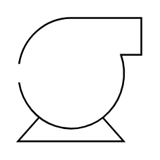
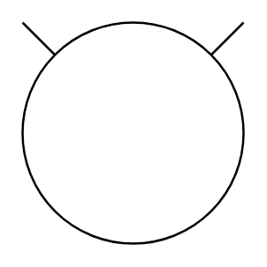
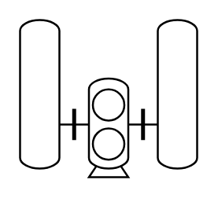
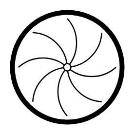
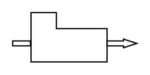
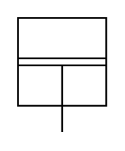

# Proc Eng Compressors Entities

- [AcAirCompressor](./ac-air-compressor.md)  

- [CentrifugalCompressor](./centrifugal-compressor.md)  

- [CentrifugalCompressorTurbineDriven](./centrifugal-compressor-turbine-driven.md)  

- [Compressor](./compressor.md)  

- [CompressorAndSilencers](./compressor-and-silencers.md)  

- [LiquidRingCompressor](./liquid-ring-compressor.md)  

- [ReciprocatingCompressor](./reciprocating-compressor.md)  

- [ReciprocatingCompressor2](./reciprocating-compressor-2.md)  

- [RotaryCompressor](./rotary-compressor.md)  

